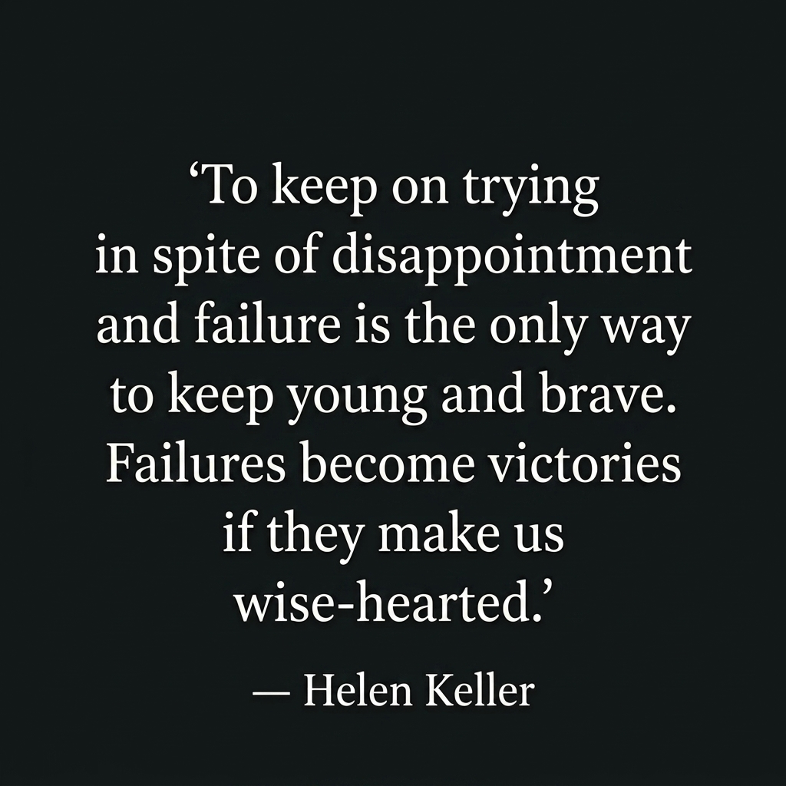

<!-- ======================= BANNER ======================= -->

  

<h1 align="center">🌸 Nice to Meet You, I'm Yeshrat Zerin Yera</h1>

  

---

## ✨ About Me

I'm **[Yeshrat Zerin Yera](https://github.com/Yeshrat-Zerin-Yera)**, an aspiring **Full-Stack Web Developer** who enjoys turning ideas into clean, functional, and engaging digital experiences.

🔹 **Frontend:** React.js · Next.js · TypeScript  
🔹 **Backend:** Node.js · Express.js · MongoDB · Mongoose  
🔹 **Currently Learning:** React Native  
🔹 **Passionate About:** Full-Stack Development · Problem Solving · Continuous Learning  
🔹 **Collaboration:** Open to exciting projects and opportunities to grow  

📫 **Email:** [yeshratzerinyera@gmail.com](mailto:yeshratzerinyera@gmail.com)  
💼 **LinkedIn:** [Yeshrat Zerin Yera](https://www.linkedin.com/in/yeshrat-zerin-yera-54b557258)

---

## 🌐 FOLLOW ME ON SOCIALS

---

## 🛠️ TECHNOLOGY STACK

### Languages

  

### CSS Frameworks & Libraries

  

### JavaScript Frameworks & Libraries

  

### Database & ORM

  

### Deployment Platforms

  

### Design & Graphics

  

### Tools & Technologies

  

---

## 📊 GITHUB STATISTICS & ANALYSIS

### 🐍 GitHub Contributions

  

### 📈 GitHub Statistics

  

 ### 💻 Top Languages

  

### 🔥 REPOSITORY STATS & STREAK

  

---

## 💭 DAILY INSPIRATION

 

---

## 👁️ PROFILE VISITS

  

---

  <b>✦ Thanks for stopping by my little corner of the internet ✦</b>

  <b>Let's build something amazing together 🚀</b>

